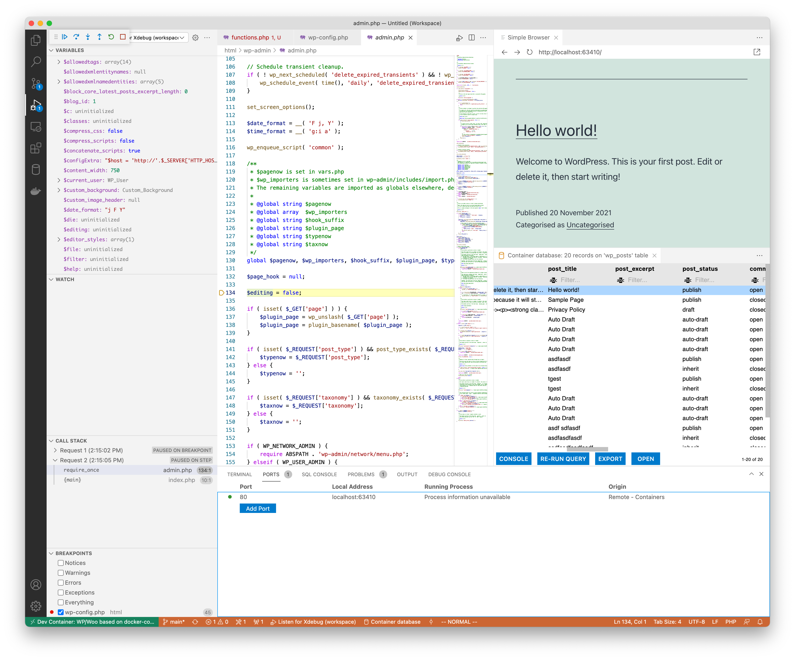

# vscode-wordpress
Devcontainer scripts to develop Wordpress extensions or sites using VSCode remote containers, with battery includes.

It should work on codespaces too.

It extends the `wordpress` docker image with, `xdebug`, `wpcli`, `composer`, `mysql`, `node`, 
and most common sense linux utils like `curl`, `zsh`, `bash`, `ssh`, `ag`, ...  
It is tested on MacOS M1 and avoid common performance issues that you will run in to using the vanilla `wordpress` docker image.




## Usage

The way vary depending on the structure of your repository and it contents. 
Below you will find the most common examples, you can copy the relevant line to
`.devcontainer/devcontainer.json` to `postStartCommand`.

## How to access the wordpress code
The wordpress code is located in /var/www/html. If you want to easily access it. You can make a link in your worksace as follows:
```
ln -s /var/www/html /workspace/html
```
Or add the folder to your workspace. The only drawnback I've notices is that the command `reopen in local folder` will stop working.
```
code -a /var/www/html
```


## Plugin or Theme development
If your repository contains a plugin source you can run (change the `my-plugin` to something that works for you)

```sh
ln -fs /workspace /var/www/html/wp-content/plugins/my-plugin
```

If your repository contains a theme set `postStartCommand` to:

```sh
ln -fs /workspace /var/www/html/wp-content/themes/my-theme
```

## Full wordpress installation
If your repository contains a full wordpress installation with all plugins and themes, the usage is more complicated.

### on Linux
The volume `/workspace` is fast enough so you can simply replace `/var/www/html/wp-content` with a link to your `wp-content`.

### on Macos
The volume `/workspace` is too slow (see Speed section), you have two options.

- Link only the necessary folders, and copy the rest to `/var/www/html/wp-content`
```sh
rsync -s /workspace/html/wp-content /var/www/html/wp-content

# if you want to edit your theme
ln -sf /workspace/html/wp-content/themes/your-theme  /var/www/html/wp-content/themes/your-theme
# This is a bit much to put in to the postStartCommand so you will need to create a script.
```

- Use vscode `Clone repository in Named Container Volume...`, and follow the Linux instructions.
For this to work unfortunately you will have to chagne the `.devcontianer/docker-compose.yml`
Instruction will follow.

### on Windows
I'm not sure how fast is the bind mount and I don't have a way to test, so use linux version if it doesn't work fall back to macos. 

## Speed consideration on MacOS
The access to a bind mounted workspace folder on MacOs is 10x solwer than access to volumes.
This makes serving wordpress directly from such mounted volume an impossibly slow (10sec to load a homepage).
The old options to solve this issue like :cached or :delegated are gone with the gRPC-FUSE driver see https://github.com/docker/for-mac/issues/5402


### Workaround for everchanging url
VScode picks a random unused port when it does port forwarding, and codespaces picks a random host name.
This is quite a good idea but it breaks wordpress as it remembers the first used url name and tries to redirect user to that url.

The way to fix this is to add a dynamic WP_HOME and WP_SITEURL as follows:
```php
          $_host = $_SERVER['HTTP_X_FORWARDED_HOST'] ?? $_SERVER['HTTP_HOST']; 
          $_proto = $_SERVER['HTTP_X_FORWARDED_PROTO'] ?? 'http'; 
          $_url = $_proto.'://'.$_host.'/'; 
          define( 'WP_HOME', $_url); 
          define( 'WP_SITEURL', $_url);
```
I've added it for you in the .devcontainer/docker-compose.yml 

If you worreid that the links are still being preserved in the database and some plugins may not respect WP_HOME and WP_SITEURL settings run the wpcli replace command as follows:
```sh
WP_URL='whaterver server you see in the browser address bar, eg. http://localhost:8080' 
wp search-replace --regex 'https?://localhost:?[0-9]*' "$WP_URL" 
```

This changes any prot to :8080.

# Thanks

I've based inital docker compose on this repo:
https://github.com/nezhar/wordpress-docker-compose/issues/76
